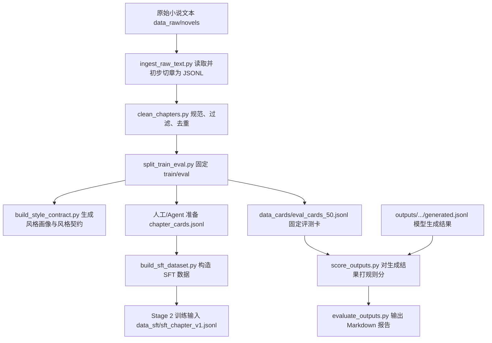

# 第一阶段数据管线中文说明

## 1. 第一阶段一句话说明

第一阶段不是训练模型，而是把原稿整理成可训练、可评测、可复查的数据资产。

换句话说，第一阶段做的是“备料”和“验料”：把原始小说文本变成统一格式的章节数据、固定评测集、风格约束、SFT 训练样本和规则评分报告。真正启动 Qwen3-4B 的 QLoRA 训练，是第二阶段的事情。

这里的几个词可以先这样理解：

- 原稿：作者或项目已有的小说正文，通常是 `.txt` 文件。
- 章节：一章完整正文，是后面构造训练样本的基本单位。
- 章节卡：给模型看的执行说明，告诉模型这一章要写什么、必须出现什么、禁止出现什么。
- SFT：监督微调数据格式，也就是一条输入配一条目标答案。
- eval：固定评测集，用来比较不同模型或不同训练结果。
- JSONL：每一行都是一个 JSON 对象的数据文件。

## 2. 从原稿到报告的数据流

第一阶段不是训练模型，而是把原稿整理成可训练、可评测、可复查的数据资产。



这条线可以按两层理解。

第一层是训练前数据准备：原始小说先进入 `data_clean/chapters_raw.jsonl`，再变成清理后的 `data_clean/chapters.jsonl`，然后固定拆成 train 和 eval。train 部分可以配合章节卡做成 `data_sft/sft_chapter_v1.jsonl`，这才是第二阶段训练要吃的输入。

第二层是评测准备：eval 部分会固定写到 `data_cards/eval_cards_50.jsonl`。以后不管是 baseline 生成、SFT smoke adapter 生成，还是正式 adapter 生成，都尽量用同一批 eval cards 来打分，这样比较才公平。

需要特别注意：章节卡不是自动从正文偷答案生成的。它应该由人工或 Agent 按约定 schema 单独准备，用来描述本章目标和约束，而不是把目标正文塞进 prompt。

## 3. 目录结构怎么看

`data_raw/novels/` 放最原始的小说文本。这里的文件通常来自作者原稿或已有素材，可能有编码差异、空行混乱、作者的话、分隔线等问题。

`data_clean/` 放清理后的章节数据。`chapters_raw.jsonl` 是初步读入的章节清单，`chapters.jsonl` 是清洗、过滤、去重后的章节清单，`chapters_split.jsonl` 是已经标好 `train` 或 `eval` 的版本。

`data_cards/` 放章节卡和评测卡。`chapter_cards.jsonl` 是训练样本构造需要的人工/Agent 章节卡，`eval_cards_50.jsonl` 是固定评测集。

`data_sft/` 放 SFT 训练数据。`sft_chapter_v1.jsonl` 是第一阶段交给第二阶段训练的核心产物。

`outputs/` 放模型生成结果和规则评分。比如 baseline 的生成可以放在 `outputs/baseline/generated.jsonl`，规则评分写到 `outputs/baseline/metrics.jsonl`。

`reports/` 放人能读的 Markdown 报告。比如 `reports/baseline_report.md` 会汇总样本数、硬门槛通过率、失败类型和是否建议进入下一步。

`scripts/` 放命令行入口。用户平时主要跑这些脚本，不需要直接调用模块函数。

`src/small_model_train/` 放可测试的核心逻辑。脚本负责接收命令行参数，模块负责真正处理数据。

`configs/` 放第二阶段训练和推理配置。配置在第一阶段可以先准备好，但真实训练仍属于第二阶段。

## 4. 核心数据格式

JSONL 的意思是：一个文件里每一行都是一个完整 JSON 对象。它适合大数据集，因为可以一行一行追加、查看、切分和排查，不必一次把整个大 JSON 数组读进内存。

章节数据表示一章原文。零基础可以先把它理解成“这章属于哪本书、是哪一章、标题是什么、正文是什么、有多少字”。

```json
{"id":"novel_a_chapter_0001","work_id":"novel_a","chapter_title":"第1章 开始","text":"章节正文示例","char_count_zh":1200,"quality_tag":"A","split":"train"}
```

这些字段名就是当前清洗和切分后的章节行使用的名字。`id` 是后面连接章节卡和评分结果的主键，`quality_tag` 表示质量标记，`split` 会在固定 train/eval 后变成 `train` 或 `eval`。

章节卡表示“要模型怎么写这一章”。它不是目标正文，而是目标、人物、约束和评测用信息。

```json
{"id":"novel_a_chapter_0001","style_contract":"只输出正文，动作承接优先。","previous_summary":"上一章林默接下委托。","chapter_goal":"林默进入旧仓库并发现异常。","chapter_structure":[{"step":1,"name":"入场","goal":"交代地点和压力","estimated_chars":"600"}],"character_states":[{"name":"林默","state":"警惕但克制","speech_style":"短句，少解释"}],"must_include":["旧仓库","加钱"],"must_not_include":["真相大白"],"ending_hook":"门外传来第二个人的脚步声。","target_word_count":"2000-2500中文汉字","source_text":"可选字段，只用于离线溯源和泄漏检查。"}
```

当前训练构造代码用章节卡里的 `id` 去连接 `data_clean/chapters_split.jsonl` 里清洗章节的 `id`。只有对应章节本身是 `split: train` 且 `quality_tag: A`，才会进入 SFT；eval 样本要保留到评测时再用。`source_text` 是可选的离线溯源字段，不能被复制到 prompt 的任何部分；`sft_builder.py` 会检查较长中文片段是否从 `source_text` 泄漏进输入，发现后直接报错。

SFT 数据是一条训练样本。`instruction` 是总任务，`input` 是章节卡和风格约束，`output` 是目标章节正文。

```json
{"instruction":"根据章节卡续写完整章节","input":"章节卡与风格约束示例","output":"目标章节正文示例"}
```

评分数据表示模型生成结果被规则检查后的结果。它可以告诉你样本得分、失败门槛、是否有常见 AI 套话线索。

```json
{"id":"novel_a_chapter_0001","char_count_zh":2180,"hard_gate_pass":true,"must_include_coverage":1.0,"forbidden_hits":[],"ai_trace_count":0,"ai_trace_matches":[],"repeated_ngram_ratio":0.0321,"failure_types":[]}
```

当前评分实现会保存 `hard_gate_pass`、`failure_types`、`char_count_zh`、`must_include_coverage`、`forbidden_hits`、`ai_trace_count`、`ai_trace_matches`、`repeated_ngram_ratio` 等字段，方便后面定位问题。

## 5. 每个脚本负责什么

| 脚本 | 输入 | 输出 | 用普通话解释 |
| --- | --- | --- | --- |
| `scripts/ingest_raw_text.py` | `data_raw/novels/*.txt` | `data_clean/chapters_raw.jsonl` | 读取原始文本，并先按章节标题切成 raw JSONL。 |
| `scripts/clean_chapters.py` | `chapters_raw.jsonl` | `chapters.jsonl` | 规范换行，按字数过滤，再去掉重复正文。 |
| `scripts/split_train_eval.py` | `chapters.jsonl` | `chapters_split.jsonl`, `eval_cards_50.jsonl` | 固定留出评测集，后面比较模型时才公平。 |
| `scripts/build_style_contract.py` | `chapters_split.jsonl` | `style_profile.json`, `style_contract.md` | 统计篇幅、段落长度、对话比例，写成风格约束。 |
| `scripts/build_sft_dataset.py` | `chapter_cards.jsonl`, `chapters_split.jsonl` | `sft_chapter_v1.jsonl` | 把章节卡和目标正文配成训练样本。 |
| `scripts/score_outputs.py` | eval cards 和模型输出 | `metrics.jsonl` | 用规则检查长度、情节覆盖、重复和 AI 味。 |
| `scripts/evaluate_outputs.py` | `metrics.jsonl` | Markdown 报告 | 把分数汇总成人能读的报告。 |
| `scripts/build_preference_dataset.py` | 低分样本 | preference candidates | 给后续偏好训练准备候选，不等于已经完成偏好训练。 |
| `scripts/detect_ai_trace.py` | 生成文本 | 命中结果 | 单独检查常见 AI 套话，作为排查线索。 |

实现细节提示：当前代码里 `ingest_raw_text.py` 会调用切章逻辑，`clean_chapters.py` 主要负责规范换行、长度过滤和重复正文过滤。上表按普通用户跑管线时看到的阶段职责来理解即可。

## 6. 每个核心模块负责什么

| 模块 | 职责 | 为什么单独拆出来 |
| --- | --- | --- |
| `io_utils.py` | 读文本、读写 JSONL | 所有脚本共用，减少格式不一致。 |
| `text_utils.py` | 统计中文字符、段落、对话、重复 | 评分和风格画像都需要同一套算法。 |
| `chapter_splitter.py` | 清洗原稿和切章 | 把脏输入处理集中到入口处。 |
| `dataset_split.py` | 固定 train/eval | 保证每次评测集一致。 |
| `style_profile.py` | 风格画像和风格契约 | 把“风格”变成可复查的统计和文字约束。 |
| `sft_builder.py` | 构造训练 prompt 和 output | 防止 source_text 泄漏到 prompt。 |
| `scoring.py` | 规则评分和失败标签 | 先用便宜规则筛出明显问题。 |
| `preference_builder.py` | 构造偏好候选 | 为后续阶段准备素材。 |
| `reporting.py` | 生成 Markdown 报告 | 让评测结果可读、可提交、可比较。 |

这些模块的拆分原则很朴素：脚本越薄越好，核心逻辑越可测试越好。比如评分规则放在 `scoring.py`，报告格式放在 `reporting.py`，以后要改报告文字时就不需要碰评分算法。

## 7. 怎样按顺序跑一遍

先把原始小说文本放到 `data_raw/novels/`，然后在项目根目录按下面顺序执行。

```powershell
python scripts/ingest_raw_text.py --input-dir data_raw/novels --output data_clean/chapters_raw.jsonl
```

执行后应该出现 `data_clean/chapters_raw.jsonl`，它是从原始文本读出来的初步章节清单。

```powershell
python scripts/clean_chapters.py --input data_clean/chapters_raw.jsonl --output data_clean/chapters.jsonl --min-chars 500 --max-chars 5000
```

执行后应该出现 `data_clean/chapters.jsonl`，它保留长度合适、正文不重复、换行更干净的章节。

```powershell
python scripts/split_train_eval.py --input data_clean/chapters.jsonl --output data_clean/chapters_split.jsonl --eval-output data_cards/eval_cards_50.jsonl --eval-count 50
```

执行后应该出现 `data_clean/chapters_split.jsonl` 和 `data_cards/eval_cards_50.jsonl`，前者标出 train/eval，后者是固定评测样本。

```powershell
python scripts/build_style_contract.py --chapters data_clean/chapters_split.jsonl --contract-output style_contract.md --profile-output style_profile.json
```

执行后应该出现 `style_contract.md` 和 `style_profile.json`，分别是给 prompt 用的风格约束和可复查的统计画像。

接着需要单独准备 `data_cards/chapter_cards.jsonl`。这一步不是脚本自动完成的，因为章节卡决定训练输入质量，必须避免把目标正文直接塞进 prompt。

```powershell
python scripts/build_sft_dataset.py --cards data_cards/chapter_cards.jsonl --chapters data_clean/chapters_split.jsonl --output data_sft/sft_chapter_v1.jsonl
```

执行后应该出现 `data_sft/sft_chapter_v1.jsonl`，这是第二阶段 QLoRA SFT 训练要使用的数据输入。

如果你已经有 baseline 或模型生成结果，比如 `outputs/baseline/generated.jsonl`，可以继续跑评测。

```powershell
python scripts/score_outputs.py --cards data_cards/eval_cards_50.jsonl --outputs outputs/baseline/generated.jsonl --output outputs/baseline/metrics.jsonl
```

执行后应该出现 `outputs/baseline/metrics.jsonl`，它是一行一条的规则评分结果。

```powershell
python scripts/evaluate_outputs.py --scores outputs/baseline/metrics.jsonl --report reports/baseline_report.md --title "Baseline Report"
```

执行后应该出现 `reports/baseline_report.md`，它把评分汇总成可以提交、对比和复查的 Markdown 报告。

## 8. 常见问题

为什么章节卡不自动生成？

因为章节卡是模型训练时看到的“题目”。如果从目标正文里自动反推得太直接，甚至把原文片段塞进卡里，模型等于提前看到了答案。第一阶段宁可让章节卡由人工或 Agent 单独准备，也要保留可检查的边界。

为什么 eval 要固定？

因为评测集如果每次都换，分数变化就不知道是模型变好了，还是题目变简单了。固定 `eval_cards_50.jsonl` 后，baseline、smoke adapter、正式 adapter 都在同一批题上比较，结果才有意义。

为什么要检查 source_text 泄漏？

`source_text` 是目标正文或接近目标正文的来源文本。如果它进入 prompt，训练就会变成复制答案，评测时也会虚高。`sft_builder.py` 会检查较长中文片段是否从 `source_text` 泄漏进输入，发现后直接报错。

为什么规则评分不能代替人工判断？

规则评分擅长抓硬问题，比如太短、太长、没覆盖必须情节、出现禁止内容、重复过高、套话明显。但小说好不好看、节奏顺不顺、人物是否成立，仍然需要人工抽检。规则评分是筛查工具，不是文学裁判。

为什么第一阶段不直接训练模型？

因为训练很贵，也很容易被脏数据、泄漏 prompt、漂移评测集误导。第一阶段先把数据、约束和评测闭环做稳，第二阶段再用这些产物启动真实 QLoRA 训练和诊断，风险更低，也更容易定位问题。

## 9. 第一阶段和第二阶段的边界

第一阶段负责数据资产：清理原稿、切出章节、固定 train/eval、生成风格画像和风格契约、构造 SFT JSONL、准备规则评分和 Markdown 报告。它可以产出训练输入，但不声称模型已经训练完成。

第二阶段负责训练执行：检查本地 Qwen3-4B 模型文件、检查 CUDA 和依赖环境、启动 LLaMA-Factory QLoRA smoke/full training、检查 adapter 文件、运行固定 eval 推理、再把生成结果交回第一阶段评分脚本。

最容易混淆的是 `data_sft/sft_chapter_v1.jsonl`。这个文件是第一阶段的终点之一，也是第二阶段的起点之一。它出现了，只表示“训练数据准备好了”，不表示“模型已经训练好了”。

偏好候选也是类似边界。`build_preference_dataset.py` 可以把低分样本整理成候选 rejected rows，但这只是给后续偏好训练准备素材，不等于已经做完 DPO、奖励模型或任何偏好训练。
