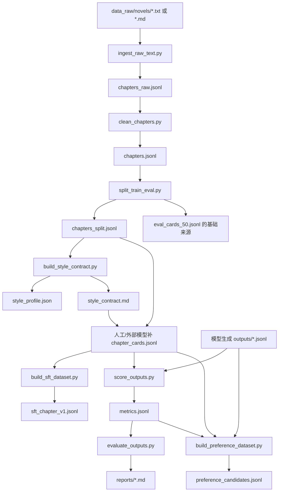

# 第一阶段数据管线与评测闭环说明

本文对应计划文件：

`docs/superpowers/plans/2026-06-17-qwen3-qlora-stage1-pipeline.md`

目标读者：完全没有机器学习工程经验，也能看懂这个系统第一阶段做了什么、为什么这样设计、每个文件负责什么、怎样从原稿走到训练数据和评测报告。

## 1. 一句话说明

第一阶段不是训练模型，而是把“训练前准备”和“评测闭环”搭好：

```text
原始 txt/md 正文
-> 清洗切章 chapters.jsonl
-> 固定 train/eval 划分
-> 生成风格契约
-> 人工或外部模型补章节卡 chapter_cards.jsonl
-> 构造 SFT 训练数据
-> 读取模型生成结果
-> 规则评分
-> 输出 Markdown 评测报告
-> 挖掘偏好训练候选
```

也就是说，第一阶段先把“数据从哪里来、怎么变成训练样本、坏输出怎么被发现、报告怎么看”跑通。正式 QLoRA 训练和本地模型推理是后续阶段。

## 2. 第一阶段计划符合性检查

结论：当前实现符合第一阶段计划文件的交付范围，并且在若干边界上做了增强。

| 计划任务 | 当前实现 | 说明 |
|---|---|---|
| Task 1 项目脚手架与文本工具 | 已实现 | `pyproject.toml`、包目录、JSONL 读写、自动编码读取、中文字数、段落、对白比例、重复度工具均已存在。 |
| Task 2 原稿清洗与切章 | 已实现并增强 | 支持标准章节标题，还支持缩进、全角空格、`第 1 章` 这类写法；保留第一章前的楔子/序章；脚本可直接从仓库根目录运行。 |
| Task 3 train/eval 固定划分 | 已实现并增强 | 用固定 seed 保证可复现；按“行位置”抽 eval，避免重复 id 时一次抽中多行。 |
| Task 4 风格画像与风格契约 | 已实现 | 统计章节数、平均汉字数、平均段落长度、对白比例，并渲染为中文风格契约。 |
| Task 5 SFT 数据构造 | 已实现并增强 | 只使用 `train` 且 `quality_tag=A` 的章节；检查章节卡是否泄漏原文连续中文片段。 |
| Task 6 规则评分与 AI 味检测 | 已实现 | 覆盖字数、提纲泄漏、必须出现覆盖率、禁止项、重复、AI 味短语，并输出失败类型。 |
| Task 7 偏好候选构造 | 已实现并增强 | 计划只要求硬门槛失败样本；当前实现会收集所有带 `failure_types` 的坏例，包括 AI 味这类软失败。 |
| Task 8 Markdown 评测报告 | 已实现并增强 | 除汇总、失败类型、最差样本、进入下一阶段结论外，还支持数据/推理快照、可选 100 分制总分与分项均分、偏好候选 Top 20。 |
| Task 9 QLoRA 与推理配置 | 已实现 | `configs/sft_qlora_qwen3_4b.yaml` 和 `configs/infer_eval_qwen3_4b.yaml` 已存在；README 有阶段一命令。 |
| Task 10 管线冒烟测试 | 已实现并增强 | 使用两章合成数据验证切章、划分、SFT 构造、评分、偏好候选和报告生成能连起来。 |

第一阶段有意不做的事情：

- 不自动生成章节卡。章节卡由人工或外部模型准备，然后交给 `build_sft_dataset.py`。
- 不启动正式 QLoRA 训练。这里只准备训练配置和训练数据。
- 不实现本地批量推理脚本。评分脚本读取已经生成好的 eval 输出 JSONL。
- 不自动做完整 LLM 盲评。报告支持接收 100 分制字段，但第一阶段核心是规则评分。

## 3. 系统架构设计

系统分为三层：

```text
scripts/
  命令行入口。负责接收参数、读文件、写文件。

src/small_model_train/
  核心逻辑。每个模块做一件事，可以被测试直接调用。

tests/
  自动化测试。验证核心函数和脚本命令能正常工作。
```

这种设计有两个好处：

1. 命令行脚本很薄，出问题时容易定位到具体模块。
2. 核心逻辑不依赖长期运行服务，Codex、人工或其他脚本都可以按文件复跑。

整体数据流如下：



## 4. 关键数据格式

### 4.1 JSONL 是什么

JSONL 就是“一行一个 JSON”。例如：

```jsonl
{"id":"work_chapter_0001","text":"第一章正文","split":"train"}
{"id":"work_chapter_0002","text":"第二章正文","split":"eval"}
```

为什么不用一个巨大的 JSON 数组？因为 JSONL 更适合大数据：

- 可以一行一行读，不必一次把所有数据塞进内存。
- 某一行坏了，报错能定位到具体行号。
- 中间结果好检查，也方便追加处理。

### 4.2 章节行 chapters.jsonl

每个章节至少包含：

```json
{
  "id": "work_001_chapter_0001",
  "work_id": "work_001",
  "chapter_title": "第1章 开始",
  "text": "正文",
  "char_count_zh": 2200,
  "quality_tag": "A",
  "split": "train"
}
```

字段含义：

| 字段 | 含义 |
|---|---|
| `id` | 章节唯一编号，后续章节卡、评分、偏好数据都靠它关联。 |
| `work_id` | 作品编号，来自文件路径。 |
| `chapter_title` | 章节标题；无标题文本会用 `未命名章节`。 |
| `text` | 清洗后的正文。 |
| `char_count_zh` | 中文汉字数，不含英文、数字、标点。 |
| `quality_tag` | 数据质量标签，第一阶段只让 A 类进入 SFT。 |
| `split` | `train` 或 `eval`。 |

### 4.3 章节卡 chapter_cards.jsonl

章节卡不是本项目自动生成的，它是“写这一章的任务单”。一张卡通常包含：

```json
{
  "id": "work_001_chapter_0001",
  "style_contract": "风格契约文本",
  "previous_summary": "上一章发生了什么",
  "chapter_goal": "本章目标",
  "chapter_structure": [],
  "character_states": [],
  "must_include": ["必须出现的信息"],
  "must_not_include": ["禁止提前揭露的信息"],
  "ending_hook": "章末钩子",
  "target_word_count": "2000-2500中文汉字"
}
```

注意：`source_text` 可以作为离线溯源字段，但不能进入模型 prompt。代码会检查章节卡 prompt 是否包含原文连续中文片段，防止训练数据泄漏。

### 4.4 SFT 训练行

SFT 行长这样：

```json
{
  "instruction": "你是作者的正文执行器...",
  "input": "风格契约 + 章节执行卡",
  "output": "作者原正文或人工修订正文"
}
```

模型训练时学的是：看到 `instruction + input`，输出 `output`。

### 4.5 评分行 metrics.jsonl

评分行示例：

```json
{
  "id": "case1",
  "char_count_zh": 1800,
  "hard_gate_pass": false,
  "must_include_coverage": 0.5,
  "forbidden_hits": ["真相是他父亲"],
  "ai_trace_count": 1,
  "ai_trace_matches": ["空气仿佛凝固了"],
  "repeated_ngram_ratio": 0.12,
  "failure_types": ["length_short", "forbidden_violation", "repetition"]
}
```

`failure_types` 是后续报告和偏好数据的关键：它告诉我们坏在哪里。

## 5. 核心模块说明

### 5.1 `io_utils.py`

负责读写文件。

- `read_text_auto()`：读取原稿时自动尝试 `utf-8-sig`、`utf-8`、`gb18030`。这样从不同写作软件导出的中文文件更容易读成功。
- `read_jsonl()`：读取 JSONL。空行会跳过；坏 JSON 会报出文件名和行号。
- `write_jsonl()`：写 JSONL，并自动创建父目录。

### 5.2 `text_utils.py`

负责中文文本统计。

- `count_chinese_chars()`：只数中文汉字，不数数字、英文、标点。
- `normalize_newlines()`：统一换行，把多余空行压成标准段落分隔。
- `paragraphs()`：按空行拆段落。
- `paragraph_lengths()`：统计每段中文汉字数。
- `dialogue_ratio()`：估算对白段落比例。
- `repeated_ngram_ratio()`：用重复 n-gram 发现明显复读。

这些指标都不是文学审美判断，只是稳定的工程信号。

### 5.3 `chapter_splitter.py`

负责把原稿切成章节。

主要做三件事：

1. 删除作者话、题外话、分隔线。
2. 识别 `第1章`、`第 1 章`、`第十二章` 等章节标题。
3. 生成统一章节字段：`id`、`work_id`、`chapter_title`、`text`、`char_count_zh`、`quality_tag`、`split`。

如果第一章前面有楔子或序章，代码会保留为 `前置正文`，避免误删正文。

### 5.4 `dataset_split.py`

负责固定切分训练集和评测集。

为什么要固定？

同一批 eval 样本要反复用于 baseline、SFT v1、SFT v2。只有 eval 不变，报告才可比较。

当前实现按“行位置”抽样，而不是按 `id` 抽样。这样即使上游不小心产生重复 id，也不会一次影响多行。

### 5.5 `style_profile.py`

负责生成风格画像和风格契约。

风格画像是统计结果：

- 有多少章。
- 平均每章多少中文汉字。
- 平均段落长度。
- 平均对白比例。

风格契约是给模型看的规则文本，包含：

- 角色定位：你是正文执行器。
- 叙述原则：动作承接优先，少写总结式心理解释。
- 对白原则：短、准、自然。
- 禁止风格：不要写常见 AI 套话。
- 输出要求：只输出正文。

### 5.6 `sft_builder.py`

负责构造 SFT 训练数据。

它做两层过滤：

1. 只使用 `split=train` 的章节，eval 章节不能进训练。
2. 只使用 `quality_tag=A` 的章节，低质量数据先不进 SFT。

它还做防泄漏检查：如果章节卡 prompt 里出现原文连续 12 个以上中文字符，就抛错。这样可以避免模型学习“复制原文”，而不是学习“根据章节卡写正文”。

### 5.7 `scoring.py`

负责规则评分。

当前自动检测：

- `length_short`：少于 2000 中文汉字。
- `length_long`：多于 2500 中文汉字。
- `outline_leak`：输出里出现提纲、小标题、提示语痕迹。
- `must_include_missing`：章节卡要求出现的信息没覆盖。
- `forbidden_violation`：出现了禁止信息。
- `repetition`：复读比例过高。
- `ai_trace`：命中常见 AI 味短语。

硬门槛目前包括：

- 字数过短或过长。
- 提纲/格式泄漏。
- 违反禁止事项。
- 明显复读。

`must_include_missing` 和 `ai_trace` 先作为失败标签保留，不直接进入硬门槛。这是为了避免第一阶段规则过严，把需要人工判断的样本全部打死。

### 5.8 `preference_builder.py`

负责把坏样本变成偏好训练候选。

输出字段：

```json
{
  "id": "case1",
  "prompt": "章节卡 prompt",
  "rejected": "坏输出",
  "reject_type": "ai_trace",
  "chosen": "",
  "source": "failed_eval"
}
```

`chosen` 暂时留空，因为它需要人工轻修版本或更强模型生成的优质版本。第一阶段先把“哪些坏样本值得修”整理出来。

### 5.9 `reporting.py`

负责生成 Markdown 报告。

报告包含：

- 配置快照。
- 样本数。
- 硬门槛通过率。
- 平均中文汉字数。
- 数据集和推理参数快照。
- 可选 100 分制均分和分项均分。
- 偏好候选 Top 20。
- 失败类型分布。
- 最差 10 条样本。
- 是否进入下一阶段的结论。

进入下一阶段的自动判断目前使用计划里的 SFT v1 硬门槛线：硬门槛通过率至少 65%。

## 6. 命令行脚本怎么用

下面命令假设你在项目根目录执行。

### 6.1 原稿入库

```powershell
python scripts/ingest_raw_text.py --input-dir data_raw/novels --output data_clean/chapters_raw.jsonl
```

作用：

- 扫描 `data_raw/novels` 下的 `.txt` 和 `.md`。
- 自动读中文编码。
- 切章。
- 写出 `chapters_raw.jsonl`。

### 6.2 清洗章节

```powershell
python scripts/clean_chapters.py --input data_clean/chapters_raw.jsonl --output data_clean/chapters.jsonl --min-chars 500 --max-chars 5000
```

作用：

- 再次统一正文换行。
- 过滤太短或太长章节。
- 去掉完全重复正文。

### 6.3 固定 train/eval

```powershell
python scripts/split_train_eval.py --input data_clean/chapters.jsonl --output data_clean/chapters_split.jsonl --eval-output data_cards/eval_cards_50.jsonl --eval-count 50
```

作用：

- 写出带 `split` 字段的全量章节。
- 额外写出 eval 子集。

注意：这里的 `eval_cards_50.jsonl` 只是 eval 章节基础数据。真正用于评分的 eval card 仍需补齐章节卡字段。

### 6.4 构建风格契约

```powershell
python scripts/build_style_contract.py --chapters data_clean/chapters_split.jsonl --contract-output style_contract.md --profile-output style_profile.json
```

作用：

- 只统计 A 类正文。
- 输出风格画像 JSON。
- 输出可放入章节卡的风格契约 Markdown。

### 6.5 构建 SFT 数据

先准备：

```text
data_cards/chapter_cards.jsonl
```

再执行：

```powershell
python scripts/build_sft_dataset.py --cards data_cards/chapter_cards.jsonl --chapters data_clean/chapters_split.jsonl --output data_sft/sft_chapter_v1.jsonl
```

作用：

- 按 `id` 匹配章节卡和正文。
- 只使用 train + A 类章节。
- 输出 SFT 训练 JSONL。

### 6.6 评分生成结果

模型生成结果需要是 JSONL，例如：

```jsonl
{"id":"case1","output":"模型生成正文"}
```

然后执行：

```powershell
python scripts/score_outputs.py --cards data_cards/eval_cards_50.jsonl --outputs outputs/baseline/generated.jsonl --output outputs/baseline/metrics.jsonl
```

作用：

- 读取 eval cards。
- 读取模型输出。
- 逐条规则评分。
- 写出 `metrics.jsonl`。

### 6.7 生成评测报告

```powershell
python scripts/evaluate_outputs.py --scores outputs/baseline/metrics.jsonl --report reports/baseline_report.md --title "Baseline Report"
```

作用：

- 汇总评分。
- 生成 Markdown 报告。
- 给出是否进入下一阶段的建议。

### 6.8 构建偏好候选

```powershell
python scripts/build_preference_dataset.py --cards data_cards/eval_cards_50.jsonl --outputs outputs/baseline/generated.jsonl --scores outputs/baseline/metrics.jsonl --output data_pref/preference_candidates.jsonl
```

作用：

- 找出带失败类型的输出。
- 保存 prompt、坏输出、失败类型。
- 等待人工补 `chosen`。

## 7. 配置文件说明

### 7.1 `configs/sft_qlora_qwen3_4b.yaml`

这是后续 QLoRA SFT 的起始配置。

关键点：

- 基座模型：`Qwen/Qwen3-4B-Instruct-2507`。
- 训练方式：LoRA + 4-bit quantization。
- `cutoff_len: 8192`，优先保住整章上下文。
- `per_device_train_batch_size: 1`，适合小显存。
- `gradient_checkpointing: true`，用速度换显存。

### 7.2 `configs/infer_eval_qwen3_4b.yaml`

这是固定评测推理参数。

关键点：

- `max_new_tokens: 5120`，支持整章输出。
- `temperature: 0.7`、`top_p: 0.8`、`top_k: 20`，作为第一版稳定参数。
- `repetition_penalty: 1.05`，轻度压制重复。

## 8. 如何理解“硬门槛”和“进入下一阶段”

硬门槛是“机器可以确定的问题”。比如：

- 字数不在 2000-2500。
- 输出里出现“以下是正文”。
- 出现禁止提前揭露的伏笔。
- 明显复读。

这些问题不需要复杂审美判断，规则就能发现。

报告里的“是否进入下一阶段”目前只看硬门槛通过率是否达到 65%。这不是最终文学质量结论，而是工程上的第一道门：

```text
硬门槛通过率低
-> 先修数据、章节卡、提示词、推理参数

硬门槛通过率达到 65%
-> 可以考虑进入下一轮训练或更细评测
```

真正的小说质量还需要人工轻修可用率、100 分制盲评和坏例复盘。

## 9. 测试体系

测试分三类：

| 类型 | 示例 | 目的 |
|---|---|---|
| 核心函数测试 | `tests/test_text_utils.py` | 确保基础统计和数据转换正确。 |
| 脚本运行测试 | `tests/test_chapter_splitter.py`、`tests/test_reporting.py` | 确保用户能从项目根目录直接运行脚本。 |
| 端到端冒烟测试 | `tests/test_pipeline_smoke.py` | 用合成数据验证第一阶段主要模块能串起来。 |

运行全部测试：

```powershell
python -m pytest -v
```

## 10. 初学者视角的系统理解

可以把这个系统理解成一条“流水线”：

1. `ingest_raw_text.py` 像收件员，把散落的原稿收进统一格式。
2. `clean_chapters.py` 像清洁工，把太短、太长、重复的章节筛掉。
3. `split_train_eval.py` 像分班老师，把一部分章节固定留作考试题。
4. `build_style_contract.py` 像编辑，把作者写法总结成规则。
5. `build_sft_dataset.py` 像出题老师，把章节卡和标准答案配成训练题。
6. `score_outputs.py` 像规则阅卷器，先查字数、禁项、复读和 AI 味。
7. `evaluate_outputs.py` 像报告员，把结果整理成 Markdown。
8. `build_preference_dataset.py` 像错题本，把坏例收集起来，等后续修成偏好数据。

核心设计思想是：每一步都输入文件、输出文件；每一步都能单独重跑；每一步都有测试保护。

## 11. 后续阶段建议

第一阶段之后，建议按这个顺序推进：

1. 准备真实 A 类正文，跑完整数据清洗与切分。
2. 人工或外部模型生成 `chapter_cards.jsonl`，并抽查防泄漏。
3. 先构建 100 条 SFT 小样本，验证 LLaMA-Factory 数据格式和显存。
4. 跑 baseline eval，记录第一份报告。
5. 再启动 QLoRA SFT v1。
6. 用同一批 eval cards 对比 baseline 和 SFT v1。
7. 从失败样本中补 `chosen`，进入偏好数据准备。

