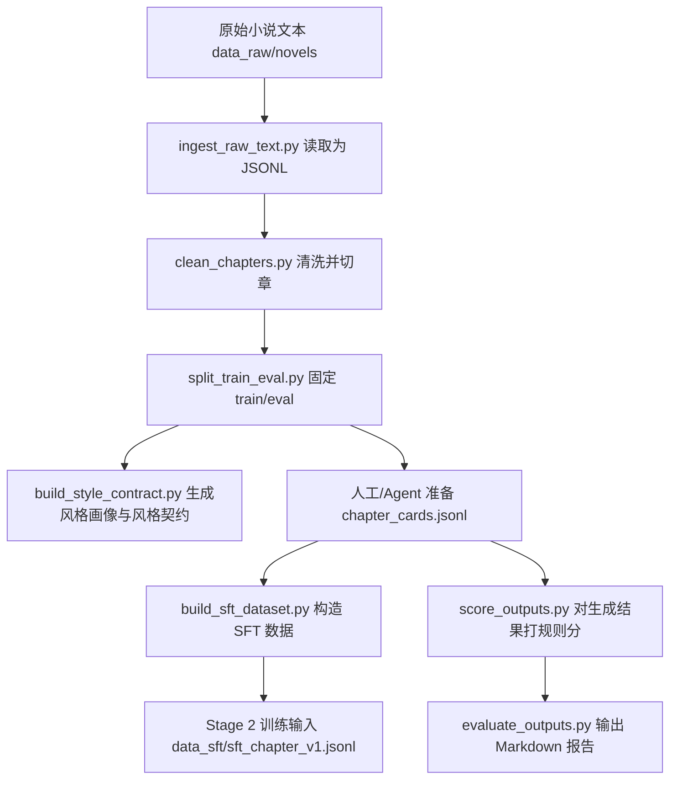

# Two-Stage Implementation Audit And Docs Implementation Plan

> **For agentic workers:** REQUIRED SUB-SKILL: Use superpowers:subagent-driven-development (recommended) or superpowers:executing-plans to implement this plan task-by-task. Steps use checkbox (`- [ ]`) syntax for tracking.

**Goal:** Audit the implemented Stage 1 and Stage 2 pipeline against their plan files, add clarifying code comments, write a zero-base Chinese Stage 1 guide, and produce a Chinese report that states whether any degradation, concealment, or false implementation exists.

**Architecture:** Keep the existing code layout unchanged: reusable logic remains in `src/small_model_train/`, CLI entry points remain in `scripts/`, and explanatory material lives under `docs/`. This work is documentation, comments, and audit evidence only; it must not silently broaden the training feature set or claim that real GPU training has run.

**Tech Stack:** Python 3.11, pytest, PowerShell, ripgrep, Markdown, and the existing project modules.

---

## File Structure

Create these files:

```text
docs/stage1-pipeline-guide.zh.md
docs/two-stage-implementation-audit.zh.md
```

Modify these files:

```text
src/small_model_train/io_utils.py
src/small_model_train/text_utils.py
src/small_model_train/chapter_splitter.py
src/small_model_train/dataset_split.py
src/small_model_train/style_profile.py
src/small_model_train/sft_builder.py
src/small_model_train/scoring.py
src/small_model_train/preference_builder.py
src/small_model_train/reporting.py
src/small_model_train/stage2_training.py
src/small_model_train/stage2_oom_probe.py
src/small_model_train/stage2_monitoring.py
scripts/stage2_oom_probe_worker.py
scripts/stage2_eval_worker.py
```

Read but do not modify unless a direct contradiction is found:

```text
README.md
docs/superpowers/plans/2026-06-17-qwen3-qlora-stage1-pipeline.md
docs/superpowers/plans/2026-06-18-qwen3-qlora-stage2-training-execution.md
docs/superpowers/specs/2026-06-18-two-stage-implementation-audit-and-docs-design.md
```

Responsibilities:

- `docs/stage1-pipeline-guide.zh.md`: zero-base explanation of Stage 1 data flow, architecture, file roles, command sequence, and boundaries.
- `docs/two-stage-implementation-audit.zh.md`: plan-to-code compliance matrix, boundary analysis, risk list, and verification evidence.
- Stage 1 module comments: explain why the pipeline uses plain text, JSONL, deterministic splitting, style contracts, leakage checks, rule scoring, and Markdown reports.
- Stage 2 module and worker comments: explain dry-run boundaries, subprocess supervision, stdout/stderr preservation, event/GPU logs, error classification, adapter header checks, and OOM probe isolation.

## Task 1: Collect Audit Evidence Against Both Plans

**Files:**
- Read: `docs/superpowers/plans/2026-06-17-qwen3-qlora-stage1-pipeline.md`
- Read: `docs/superpowers/plans/2026-06-18-qwen3-qlora-stage2-training-execution.md`
- Read: `README.md`
- Read: `src/small_model_train/*.py`
- Read: `scripts/*.py`
- Read: `tests/*.py`

- [ ] **Step 1: Confirm the branch and working tree**

Run:

```powershell
git status --short --branch
```

Expected: branch is `codex/two-stage-audit-docs`; no modified or untracked implementation files before this task starts.

- [ ] **Step 2: Capture the current file inventory**

Run:

```powershell
rg --files src scripts tests docs README.md | Sort-Object
```

Expected: the output includes all Stage 1 modules, all Stage 2 modules, both existing phase plan files, and the design file for this audit task.

- [ ] **Step 3: Capture the Stage 1 implementation map**

Run:

```powershell
rg -n "^(def |class |@dataclass|if __name__|\"\"\")" src\small_model_train scripts tests
```

Record the Stage 1 mapping for the audit report:

```text
原稿读取与 JSONL：src/small_model_train/io_utils.py; scripts/ingest_raw_text.py; tests/test_pipeline_smoke.py; tests/test_text_utils.py
文本清洗与章节切分：src/small_model_train/text_utils.py; src/small_model_train/chapter_splitter.py; scripts/clean_chapters.py; tests/test_text_utils.py; tests/test_chapter_splitter.py
确定性切分：src/small_model_train/dataset_split.py; scripts/split_train_eval.py; tests/test_dataset_split.py
风格画像与契约：src/small_model_train/style_profile.py; scripts/build_style_contract.py; tests/test_style_profile.py
SFT 构造与 source_text 泄漏检查：src/small_model_train/sft_builder.py; scripts/build_sft_dataset.py; tests/test_sft_builder.py
AI 味检测与规则评分：src/small_model_train/scoring.py; scripts/detect_ai_trace.py; scripts/score_outputs.py; tests/test_scoring.py
偏好候选构造：src/small_model_train/preference_builder.py; scripts/build_preference_dataset.py; tests/test_preference_builder.py
Markdown 报告：src/small_model_train/reporting.py; scripts/evaluate_outputs.py; tests/test_reporting.py
端到端 smoke：tests/test_pipeline_smoke.py
```

- [ ] **Step 4: Capture the Stage 2 implementation map**

Record the Stage 2 mapping for the audit report:

```text
本地模型检查：src/small_model_train/stage2_model_check.py; scripts/check_local_model.py; tests/test_stage2_model_check.py
训练环境检查：src/small_model_train/stage2_env_check.py; scripts/check_training_env.py; tests/test_stage2_env_check.py
配置快照与命令构造：src/small_model_train/stage2_config.py; tests/test_stage2_config.py
训练监控与失败分类：src/small_model_train/stage2_monitoring.py; tests/test_stage2_monitoring.py
smoke/full 训练启动器：src/small_model_train/stage2_training.py; scripts/run_sft_smoke.py; scripts/run_sft_train.py; tests/test_stage2_training.py
adapter 静态校验：src/small_model_train/stage2_adapter.py; scripts/check_adapter.py; tests/test_stage2_adapter.py
OOM probe：src/small_model_train/stage2_oom_probe.py; scripts/run_oom_probe.py; scripts/stage2_oom_probe_worker.py; tests/test_stage2_oom_probe.py
固定 eval 推理：src/small_model_train/stage2_inference.py; scripts/run_eval_inference.py; scripts/stage2_eval_worker.py; tests/test_stage2_inference.py
Stage 2 命令序列：README.md
```

- [ ] **Step 5: Run the baseline test suite**

Run:

```powershell
python -m pytest -q
```

Expected: all tests pass. Record the exact pass count and duration for the final audit report.

- [ ] **Step 6: Search for implementation red flags without embedding the pattern as one literal**

Run:

```powershell
$patterns = @("to" + "do", "tb" + "d", "place" + "holder", "fa" + "ke", "st" + "ub", "not" + "implemented", "pass$")
rg -n -i ($patterns -join "|") docs src scripts
```

Expected: any matches are reviewed manually. Matches inside historical plan/spec text are evidence to classify, not automatic defects.

- [ ] **Step 7: Inspect real execution boundaries**

Run:

```powershell
rg -n "dry_run|dry-run|subprocess|Popen|returncode|exit_code|stderr|stdout|classify_training_error|run_training_dry|run_training_subprocess|run_oom_probes" src scripts README.md
```

Expected: the evidence shows dry-run paths are explicitly named, subprocess paths preserve exit codes, and Stage 2 failure classification uses both stdout and stderr.

- [ ] **Step 8: Commit no files for this evidence-only task**

Run:

```powershell
git status --short
```

Expected: no tracked file changed during Task 1.

## Task 2: Add Stage 1 Code Comments And Docstrings

**Files:**
- Modify: `src/small_model_train/io_utils.py`
- Modify: `src/small_model_train/text_utils.py`
- Modify: `src/small_model_train/chapter_splitter.py`
- Modify: `src/small_model_train/dataset_split.py`
- Modify: `src/small_model_train/style_profile.py`
- Modify: `src/small_model_train/sft_builder.py`
- Modify: `src/small_model_train/scoring.py`
- Modify: `src/small_model_train/preference_builder.py`
- Modify: `src/small_model_train/reporting.py`
- Test: `tests/test_text_utils.py`
- Test: `tests/test_chapter_splitter.py`
- Test: `tests/test_dataset_split.py`
- Test: `tests/test_style_profile.py`
- Test: `tests/test_sft_builder.py`
- Test: `tests/test_preference_builder.py`
- Test: `tests/test_scoring.py`
- Test: `tests/test_reporting.py`
- Test: `tests/test_pipeline_smoke.py`

- [ ] **Step 1: Add module-level responsibility docstrings**

Insert one module docstring as the first statement in each file. Use these exact texts unless the surrounding code already has a clearer equivalent:

```python
"""Shared file I/O helpers for the two-stage training pipeline.

The pipeline exchanges data through inspectable UTF-8 text and JSONL files
instead of an in-memory service. That keeps every stage reproducible from the
command line and leaves artifacts behind when a later training run fails.
"""
```

```python
"""Text statistics and normalization helpers used by Stage 1 scoring.

These helpers are intentionally deterministic and model-free. Stage 1 needs
cheap, repeatable checks before any GPU training is attempted.
"""
```

```python
"""Raw novel cleanup and chapter extraction for Stage 1.

This module turns messy source text into chapter records. It does not infer
missing chapter cards; those remain an explicit human/agent-authored artifact
so the SFT prompt does not accidentally leak the answer.
"""
```

```python
"""Deterministic train/eval splitting for cleaned chapter rows.

The split is seed-based so repeated runs produce the same fixed evaluation set.
That fixed set is what makes Stage 2 adapter comparisons meaningful.
"""
```

```python
"""Style profile and style contract generation for Stage 1.

The profile summarizes observable chapter statistics. The contract is a compact
prompt-facing description, not a learned model of authorial style.
"""
```

```python
"""SFT prompt construction from chapter cards and cleaned chapters.

The builder joins explicit planning cards with target chapter text. It also
guards against copying source_text into the prompt, because that would turn
training into answer leakage rather than instruction following.
"""
```

```python
"""Rule-based output scoring and AI-trace detection.

These scores are not a replacement for human literary review. They provide
stable gates for length, required plot coverage, repetition, and generic AI
phrasing so failed samples can be triaged consistently.
"""
```

```python
"""Preference-candidate construction from failed scoring rows.

Stage 1 only prepares candidate pairs for later preference work. It does not
pretend that a reward model or DPO training loop has already been run.
"""
```

```python
"""Markdown reporting for Stage 1 scoring results.

Reports are intentionally plain Markdown so they can be reviewed, committed, and
compared without a dashboard or database.
"""
```

- [ ] **Step 2: Add targeted inline comments for boundaries that are easy to misread**

Add a short comment above or inside each listed function:

```text
src/small_model_train/dataset_split.py::split_rows
Comment: The eval subset is fixed by seed and index assignment; it is not re-sampled per training run.

src/small_model_train/sft_builder.py::_find_source_text_leak
Comment: This check catches long verbatim spans before SFT rows are written, preventing answer leakage into prompts.

src/small_model_train/sft_builder.py::build_sft_rows
Comment: Non-train rows are skipped deliberately; eval rows must stay unseen so later adapter scores mean something.

src/small_model_train/scoring.py::detect_ai_trace
Comment: The phrase list is a deterministic triage rule, not proof that a model generated the text.

src/small_model_train/reporting.py::summarize_scores
Comment: Missing numeric metrics are ignored instead of coerced to zero so incomplete rows do not invent poor scores.
```

- [ ] **Step 3: Run Stage 1 tests**

Run:

```powershell
python -m pytest tests/test_text_utils.py tests/test_chapter_splitter.py tests/test_dataset_split.py tests/test_style_profile.py tests/test_sft_builder.py tests/test_preference_builder.py tests/test_scoring.py tests/test_reporting.py tests/test_pipeline_smoke.py -q
```

Expected: all selected Stage 1 tests pass.

- [ ] **Step 4: Check formatting-sensitive whitespace**

Run:

```powershell
git diff --check
```

Expected: no whitespace errors.

- [ ] **Step 5: Commit Stage 1 comment changes**

Run:

```powershell
git add src/small_model_train/io_utils.py src/small_model_train/text_utils.py src/small_model_train/chapter_splitter.py src/small_model_train/dataset_split.py src/small_model_train/style_profile.py src/small_model_train/sft_builder.py src/small_model_train/scoring.py src/small_model_train/preference_builder.py src/small_model_train/reporting.py
git commit -m "docs: clarify stage one pipeline internals"
```

Expected: commit succeeds and contains only comments/docstrings.

## Task 3: Add Stage 2 Safety Boundary Comments

**Files:**
- Modify: `src/small_model_train/stage2_training.py`
- Modify: `src/small_model_train/stage2_oom_probe.py`
- Modify: `src/small_model_train/stage2_monitoring.py`
- Modify: `scripts/stage2_oom_probe_worker.py`
- Modify: `scripts/stage2_eval_worker.py`
- Test: `tests/test_stage2_training.py`
- Test: `tests/test_stage2_monitoring.py`
- Test: `tests/test_stage2_oom_probe.py`
- Test: `tests/test_stage2_inference.py`

- [ ] **Step 1: Add Stage 2 module docstrings**

Add these first-statement docstrings:

```python
"""Training subprocess supervision for Stage 2 QLoRA runs.

This module builds LLaMA-Factory commands and supervises them from the parent
process. The parent keeps stdout, stderr, event logs, GPU samples, and failure
summaries so a child crash does not erase the reason the run failed.
"""
```

```python
"""OOM and crash probe orchestration for Stage 2.

Each probe runs in a separate worker process. That isolation is deliberate: if
CUDA, bitsandbytes, or the driver kills a worker, the parent can still record
which probe failed and where the logs live.
"""
```

```python
"""Stage 2 event logging, GPU sampling, and error classification.

The functions here convert noisy launcher output into durable evidence. They do
not mark training successful; callers still decide from subprocess exit codes
and adapter checks.
"""
```

```python
"""Worker process for isolated Stage 2 OOM probes.

The parent probe runner starts this script repeatedly. Keeping risky model-load
and one-step training work in this worker protects the parent process from
losing diagnostic context after CUDA or dependency crashes.
"""
```

```python
"""Worker process for fixed eval inference.

The launcher keeps this GPU-heavy path in a child process so stdout, stderr, and
exit codes remain visible even when model loading or generation fails.
"""
```

- [ ] **Step 2: Comment dry-run and real subprocess distinctions**

Add comments at these locations:

```text
src/small_model_train/stage2_training.py::run_training_dry
Comment: This path only records the command and config snapshot; it is never evidence that training completed.

src/small_model_train/stage2_training.py::run_training_subprocess
Comment: Real training enters here; stdout and stderr are streamed before classification so late crashes still leave logs.

scripts/run_sft_smoke.py::main
Comment near dry-run branch: dry-run is a preflight for command construction and should not be described as a trained adapter.

scripts/run_sft_train.py::main
Comment near dry-run branch: full-run dry-run validates prerequisites and the launch command without consuming GPU memory.
```

Only modify `scripts/run_sft_smoke.py` and `scripts/run_sft_train.py` if they do not already make this boundary clear in code. If the comments are unnecessary after inspection, leave those two files untouched and mention the decision in the audit report.

- [ ] **Step 3: Comment OOM probe diagnostics**

Add comments at these locations:

```text
src/small_model_train/stage2_oom_probe.py::run_one_probe
Comment: Every probe gets separate stdout, stderr, event, and GPU logs so the last successful phase is recoverable after a crash.

src/small_model_train/stage2_oom_probe.py::_communicate_streams
Comment: The parent streams both pipes while the child runs; this avoids losing buffered output when the child exits abruptly.

scripts/stage2_oom_probe_worker.py::_probe_one_step_training
Comment: Probes 5-7 intentionally override cutoff_len/rank/max_steps to isolate the smallest setting that still fails.
```

- [ ] **Step 4: Comment monitoring and adapter safety boundaries**

Add comments at these locations:

```text
src/small_model_train/stage2_monitoring.py::classify_training_error
Comment: Classification is advisory; a nonzero exit code still remains the source of truth for failure.

src/small_model_train/stage2_monitoring.py::render_failure_summary
Comment: Include stdout and stderr tails because some launchers print CUDA failures to stdout.

src/small_model_train/stage2_training.py::_write_failure_report
Comment: The failure report is generated only after a nonzero exit so it cannot mask a failed run as successful.
```

- [ ] **Step 5: Run Stage 2 tests**

Run:

```powershell
python -m pytest tests/test_stage2_training.py tests/test_stage2_monitoring.py tests/test_stage2_oom_probe.py tests/test_stage2_inference.py -q
```

Expected: all selected Stage 2 tests pass.

- [ ] **Step 6: Check whitespace**

Run:

```powershell
git diff --check
```

Expected: no whitespace errors.

- [ ] **Step 7: Commit Stage 2 comment changes**

Run:

```powershell
git add src/small_model_train/stage2_training.py src/small_model_train/stage2_oom_probe.py src/small_model_train/stage2_monitoring.py scripts/stage2_oom_probe_worker.py scripts/stage2_eval_worker.py scripts/run_sft_smoke.py scripts/run_sft_train.py
git commit -m "docs: clarify stage two training diagnostics"
```

Expected: commit succeeds. If `scripts/run_sft_smoke.py` or `scripts/run_sft_train.py` were not modified, omit them from `git add`.

## Task 4: Write The Stage 1 Zero-Base Chinese Guide

**Files:**
- Create: `docs/stage1-pipeline-guide.zh.md`
- Read: `README.md`
- Read: `docs/superpowers/plans/2026-06-17-qwen3-qlora-stage1-pipeline.md`
- Read: `src/small_model_train/*.py`
- Read: `scripts/*.py`

- [ ] **Step 1: Create the document with this exact heading structure**

Create `docs/stage1-pipeline-guide.zh.md`:

```markdown
# 第一阶段数据管线中文说明

## 1. 第一阶段一句话说明

## 2. 从原稿到报告的数据流

## 3. 目录结构怎么看

## 4. 核心数据格式

## 5. 每个脚本负责什么

## 6. 每个核心模块负责什么

## 7. 怎样按顺序跑一遍

## 8. 常见问题

## 9. 第一阶段和第二阶段的边界
```

- [ ] **Step 2: Explain the data flow in plain Chinese**

Under section 2, include this Mermaid diagram:



Also explain in prose:

```text
第一阶段不是训练模型，而是把原稿整理成可训练、可评测、可复查的数据资产。
```

- [ ] **Step 3: Explain the core data formats with examples**

Include examples for these formats:

```json
{"work_id":"novel_a","chapter_id":"novel_a_ch001","title":"第一章","text":"章节正文示例","char_count":1200}
```

```json
{"sample_id":"novel_a_ch001","work_id":"novel_a","chapter_id":"novel_a_ch001","split":"train","outline":"本章目标示例","characters":[{"name":"林默","role":"主角"}]}
```

```json
{"instruction":"根据章节卡续写完整章节","input":"章节卡与风格约束示例","output":"目标章节正文示例"}
```

```json
{"sample_id":"novel_a_ch001","score":0.82,"failed_gates":[],"ai_trace":{"has_trace":false,"hits":[]}}
```

Explain that JSONL means one JSON object per line, which makes large datasets easy to append, inspect, and split.

- [ ] **Step 4: Explain every Stage 1 script in a table**

Use this table shape:

```markdown
| 脚本 | 输入 | 输出 | 用普通话解释 |
| --- | --- | --- | --- |
| `scripts/ingest_raw_text.py` | `data_raw/novels/*.txt` | `data_clean/chapters_raw.jsonl` | 把很多文本文件统一读进一张“清单”。 |
| `scripts/clean_chapters.py` | `chapters_raw.jsonl` | `chapters.jsonl` | 清理换行和杂质，再按章节标题切开。 |
| `scripts/split_train_eval.py` | `chapters.jsonl` | `chapters_split.jsonl`, `eval_cards_50.jsonl` | 固定留出评测集，后面比较模型时才公平。 |
| `scripts/build_style_contract.py` | `chapters_split.jsonl` | `style_profile.json`, `style_contract.md` | 统计篇幅、对话比例、重复度，写成风格约束。 |
| `scripts/build_sft_dataset.py` | `chapter_cards.jsonl`, `chapters_split.jsonl` | `sft_chapter_v1.jsonl` | 把章节卡和目标正文配成训练样本。 |
| `scripts/score_outputs.py` | eval cards 和模型输出 | `metrics.jsonl` | 用规则检查长度、情节覆盖、重复和 AI 味。 |
| `scripts/evaluate_outputs.py` | `metrics.jsonl` | Markdown 报告 | 把分数汇总成人能读的报告。 |
| `scripts/build_preference_dataset.py` | 低分样本 | preference candidates | 给后续偏好训练准备候选，不等于已经完成偏好训练。 |
| `scripts/detect_ai_trace.py` | 生成文本 | 命中结果 | 单独检查常见 AI 套话，作为排查线索。 |
```

- [ ] **Step 5: Explain every Stage 1 module in a table**

Use this table shape:

```markdown
| 模块 | 职责 | 为什么单独拆出来 |
| --- | --- | --- |
| `io_utils.py` | 读文本、读写 JSONL | 所有脚本共用，减少格式不一致。 |
| `text_utils.py` | 统计中文字符、段落、对话、重复 | 评分和风格画像都需要同一套算法。 |
| `chapter_splitter.py` | 清洗原稿和切章 | 把脏输入处理集中到入口处。 |
| `dataset_split.py` | 固定 train/eval | 保证每次评测集一致。 |
| `style_profile.py` | 风格画像和风格契约 | 把“风格”变成可复查的统计和文字约束。 |
| `sft_builder.py` | 构造训练 prompt 和 output | 防止 source_text 泄漏到 prompt。 |
| `scoring.py` | 规则评分和失败标签 | 先用便宜规则筛出明显问题。 |
| `preference_builder.py` | 构造偏好候选 | 为后续阶段准备素材。 |
| `reporting.py` | 生成 Markdown 报告 | 让评测结果可读、可提交、可比较。 |
```

- [ ] **Step 6: Add the run sequence from README with explanations**

Include the Stage 1 command sequence from `README.md` and add one sentence after each command explaining what artifact should appear. Use the real paths:

```text
data_clean/chapters_raw.jsonl
data_clean/chapters.jsonl
data_clean/chapters_split.jsonl
data_cards/eval_cards_50.jsonl
style_contract.md
style_profile.json
data_sft/sft_chapter_v1.jsonl
outputs/baseline/metrics.jsonl
reports/baseline_report.md
```

- [ ] **Step 7: Add common questions**

Include answers for:

```text
为什么章节卡不自动生成？
为什么 eval 要固定？
为什么要检查 source_text 泄漏？
为什么规则评分不能代替人工判断？
为什么第一阶段不直接训练模型？
```

- [ ] **Step 8: Commit the guide**

Run:

```powershell
git add docs/stage1-pipeline-guide.zh.md
git commit -m "docs: add stage one chinese pipeline guide"
```

Expected: commit succeeds and the document is self-contained for a zero-base reader.

## Task 5: Write The Two-Stage Implementation Audit Report

**Files:**
- Create: `docs/two-stage-implementation-audit.zh.md`
- Read: `docs/stage1-pipeline-guide.zh.md`
- Read: both phase plan files
- Read: all modified source and script files
- Read: test output from Task 1, Task 2, and Task 3

- [ ] **Step 1: Create the audit report with this heading structure**

Create `docs/two-stage-implementation-audit.zh.md`:

```markdown
# 两阶段实现审计报告

## 1. 审计结论摘要

## 2. Stage 1 计划符合性矩阵

## 3. Stage 2 计划符合性矩阵

## 4. 降级、掩饰、虚假实现专项审查

## 5. 已知合理边界

## 6. 风险清单与建议后续动作

## 7. 验证命令与结果
```

- [ ] **Step 2: Write the conclusion summary**

Use this conclusion shape, adjusting only if Task 1 evidence contradicts it:

```text
本轮审计以两个阶段计划文件为准，对 src、scripts、tests、README 的实现逐项核对。当前实现总体符合 Stage 1 数据管线与 Stage 2 训练执行前置/监督/诊断设计；未发现把 dry-run 描述成真实训练完成的代码路径，也未发现用空函数或固定假结果冒充训练、推理、评分成功的实现。

需要明确的是：自动化测试覆盖的是数据处理、命令构造、报告生成、错误分类和诊断框架；真实 QLoRA 训练、真实 GPU 推理、真实 adapter 质量仍必须在本地训练环境中按 README 命令执行后确认。这属于计划边界，不属于已完成真实训练的证明。
```

- [ ] **Step 3: Write the Stage 1 matrix**

Use this table shape and include these rows:

```markdown
| 计划任务 | 对应实现文件 | 对应测试文件 | 结论 | 简要说明 |
| --- | --- | --- | --- | --- |
| 项目脚手架与共享文本工具 | `pyproject.toml`, `src/small_model_train/io_utils.py`, `text_utils.py` | `tests/test_text_utils.py`, `tests/test_pipeline_smoke.py` | 符合 | 已有包结构、pytest 配置、JSONL 和文本工具。 |
| 原稿清洗与切章 | `chapter_splitter.py`, `scripts/clean_chapters.py`, `scripts/ingest_raw_text.py` | `tests/test_chapter_splitter.py`, `tests/test_pipeline_smoke.py` | 符合 | 支持文本读取、清洗、章节抽取与最小/最大长度过滤。 |
| 确定性 train/eval 切分 | `dataset_split.py`, `scripts/split_train_eval.py` | `tests/test_dataset_split.py` | 符合 | 通过 seed 固定 eval，避免后续比较漂移。 |
| 风格画像与风格契约 | `style_profile.py`, `scripts/build_style_contract.py` | `tests/test_style_profile.py` | 符合 | 输出统计画像和 Markdown 风格约束。 |
| SFT 数据构造 | `sft_builder.py`, `scripts/build_sft_dataset.py` | `tests/test_sft_builder.py` | 符合 | 从章节卡和章节正文构造 instruction/input/output，并检查 source_text 泄漏。 |
| 规则评分与 AI 味检测 | `scoring.py`, `scripts/score_outputs.py`, `scripts/detect_ai_trace.py` | `tests/test_scoring.py` | 符合 | 规则评分覆盖长度、情节覆盖、重复和 AI 套话命中。 |
| 偏好候选构造 | `preference_builder.py`, `scripts/build_preference_dataset.py` | `tests/test_preference_builder.py` | 合理边界 | 只准备候选，不声明已训练 reward/DPO。 |
| Markdown 评测报告 | `reporting.py`, `scripts/evaluate_outputs.py` | `tests/test_reporting.py` | 符合 | 汇总规则分数和失败标签，生成可读报告。 |
| QLoRA 与推理配置 | `configs/sft_qlora_qwen3_4b.yaml`, `configs/infer_eval_qwen3_4b.yaml` | Stage 2 配置测试间接覆盖 | 符合 | 配置作为 Stage 2 输入存在，真实训练在 Stage 2 执行。 |
| 端到端 smoke test | `tests/test_pipeline_smoke.py` | `tests/test_pipeline_smoke.py` | 符合 | 覆盖 Stage 1 主要数据流。 |
```

- [ ] **Step 4: Write the Stage 2 matrix**

Use this table shape and include these rows:

```markdown
| 计划任务 | 对应实现文件 | 对应测试文件 | 结论 | 简要说明 |
| --- | --- | --- | --- | --- |
| 本地模型文件与 transformers 加载检查 | `stage2_model_check.py`, `scripts/check_local_model.py` | `tests/test_stage2_model_check.py` | 符合 | 检查必需文件、safetensors 分片和可选 transformers 加载。 |
| 训练环境、CUDA、依赖与 VRAM 检查 | `stage2_env_check.py`, `scripts/check_training_env.py` | `tests/test_stage2_env_check.py` | 符合 | 收集包版本、CUDA 可用性、nvidia-smi 与显存建议。 |
| 配置快照与 LLaMA-Factory 命令构造 | `stage2_config.py`, `stage2_training.py` | `tests/test_stage2_config.py`, `tests/test_stage2_training.py` | 符合 | 训练前写出快照，再构造 `llamafactory-cli train` 命令。 |
| 训练事件日志、GPU 采样和错误分类 | `stage2_monitoring.py`, `stage2_training.py` | `tests/test_stage2_monitoring.py`, `tests/test_stage2_training.py` | 符合 | 保存事件、GPU 样本、stdout/stderr 和失败摘要。 |
| smoke/full 训练启动器 | `scripts/run_sft_smoke.py`, `scripts/run_sft_train.py` | `tests/test_stage2_training.py` | 符合 | dry-run 与真实 subprocess 路径分离，真实执行保留 exit code。 |
| adapter 静态校验 | `stage2_adapter.py`, `scripts/check_adapter.py` | `tests/test_stage2_adapter.py` | 符合 | 检查 adapter config、权重文件和 safetensors header。 |
| OOM probe 执行框架 | `stage2_oom_probe.py`, `scripts/run_oom_probe.py`, `scripts/stage2_oom_probe_worker.py` | `tests/test_stage2_oom_probe.py` | 符合 | 父进程逐个启动 worker，并为每个 probe 记录 stdout、stderr、event、GPU 日志。 |
| 固定 eval 推理和 Stage 1 评分衔接 | `stage2_inference.py`, `scripts/run_eval_inference.py`, `scripts/stage2_eval_worker.py`, `scripts/score_outputs.py` | `tests/test_stage2_inference.py`, `tests/test_scoring.py` | 合理边界 | 推理入口存在，真实生成依赖本地 GPU 与 adapter；评分复用 Stage 1 规则。 |
| README Stage 2 命令序列 | `README.md` | 手动命令链路审查 | 符合 | README 先检查模型/环境，再 dry-run、smoke、OOM probe、full train、eval。 |
```

- [ ] **Step 5: Write the degradation/concealment/false-implementation review**

Include these findings if Task 1 evidence remains consistent:

```text
未发现的问题：
- 未发现真实训练函数直接返回成功而不启动 subprocess。
- 未发现 OOM probe 只写静态报告；默认入口会执行 probes，`--dry-run` 才只写计划。
- 未发现训练失败被吞掉后仍作为成功返回；非零 exit code 会进入 failure report。
- 未发现 Stage 1 评分用固定高分冒充评测；评分由输入文本和章节卡规则计算。
- 未发现 adapter 检查只看目录存在；它会检查配置、权重和 safetensors header。

需要如实说明的边界：
- dry-run 是命令和配置预演，不代表训练成功。
- 单元测试不会加载真实 4-bit Qwen3，也不会跑真实 GPU 训练。
- Stage 1 章节卡需要额外准备，系统不自动从正文生成完整章节卡。
- 固定 eval 推理入口存在，但真实输出质量要等本地 adapter 生成后评分。
```

- [ ] **Step 6: Write the risk list**

Include these risks unless implementation evidence proves they no longer apply:

```markdown
| 级别 | 风险 | 影响 | 建议 |
| --- | --- | --- | --- |
| Important | `stage2_oom_probe_worker.py` 中 probes 5-7 将 `dataset` 指向 JSONL 路径，并将 `dataset_dir` 指向其父目录，是否完全匹配本地 LLaMA-Factory 数据集注册方式取决于本机配置。 | one-step training probe 可能因数据集解析方式失败，需要结合 stderr 判断。 | 首次执行时保留 probe 配置快照和 stderr；如确认为数据集注册问题，再增加 LLaMA-Factory dataset_info 适配任务。 |
| Minor | Stage 1 规则评分只能发现结构化问题，不能证明文学质量。 | 低分样本便于排查，高分仍需人工抽检。 | 在评测报告中保留人工复核样本。 |
| Minor | 自动测试使用小样本和模拟输出，不覆盖长章节真实显存压力。 | 测试通过不等于真实训练不会 OOM。 | 按 README 先跑 smoke 和 OOM probe，再 full train。 |
```

- [ ] **Step 7: Record final verification commands**

Add a table with exact commands and actual results:

```markdown
| 命令 | 结果 |
| --- | --- |
| `python -m pytest -q` | 使用实际输出，例如 `128 passed in 1.26s`。 |
| `$patterns = @("to" + "do", "tb" + "d", "place" + "holder", "fa" + "ke", "st" + "ub", "not" + "implemented", "pass$"); rg -n -i ($patterns -join "|") docs src scripts` | 写明是否只有历史计划/规格命中，或列出需要解释的代码命中。 |
| `git diff --check` | 写明是否无输出。 |
| `git status --short` | 写明最终是否只有预期文件改动，提交后应为空。 |
```

- [ ] **Step 8: Commit the audit report**

Run:

```powershell
git add docs/two-stage-implementation-audit.zh.md
git commit -m "docs: add two-stage implementation audit"
```

Expected: commit succeeds.

## Task 6: Final Verification And Review

**Files:**
- Verify: all created and modified files
- Verify: all tests
- Verify: git history and status

- [ ] **Step 1: Run the full test suite**

Run:

```powershell
python -m pytest -q
```

Expected: all tests pass.

- [ ] **Step 2: Run the static red-flag scan**

Run:

```powershell
$patterns = @("to" + "do", "tb" + "d", "place" + "holder", "fa" + "ke", "st" + "ub", "not" + "implemented", "pass$")
rg -n -i ($patterns -join "|") docs src scripts
```

Expected: report each hit in `docs/two-stage-implementation-audit.zh.md` when it is relevant. Matches inside archived plan/spec requirements are acceptable if they are clearly historical context rather than live implementation defects.

- [ ] **Step 3: Run Markdown/source whitespace checks**

Run:

```powershell
git diff --check
```

Expected: no output.

- [ ] **Step 4: Review the final diff**

Run:

```powershell
git diff --stat main HEAD
git diff -- docs src scripts
```

Expected: diff contains documentation and comments only, with no behavior-changing Python edits.

- [ ] **Step 5: Confirm the worktree is clean after commits**

Run:

```powershell
git status --short --branch
```

Expected: branch is `codex/two-stage-audit-docs` and no uncommitted files remain.

- [ ] **Step 6: Produce the completion summary**

Final response should include:

```text
已完成：
- 第一阶段零基础中文说明文档路径。
- 两阶段实现审计报告路径。
- 代码注释补充范围。
- 测试和静态检查结果。
- 审计结论：是否发现降级、掩饰、虚假实现。
```

If any risk remains, list the risk with severity and point to the audit report section.
